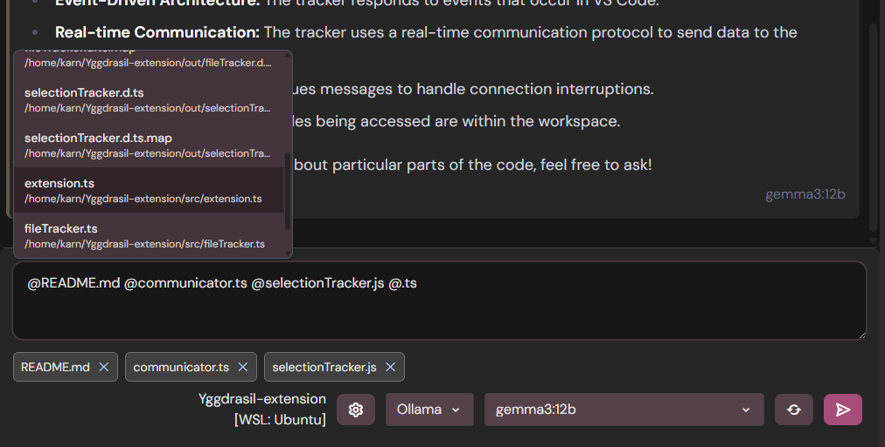
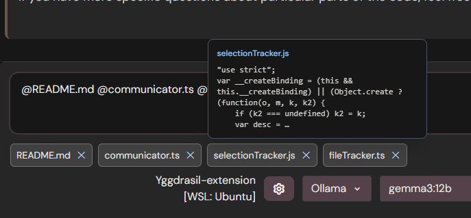

# Yggdrasil

**The first AI interface designed for parallel workflows with branches.**

While existing interfaces support editing messages and branching from them, Yggdrasil elevates this concept to its core philosophy. Built for humans first, AI second.

## Designed For Humans

We believe humans don't solve problems linearly like traditional chat interfaces suggest. Our thinking process involves:

- **Tangents and explorations** when questioning assumptions
- **Non-linear knowledge building** as we discover new information
- **Multiple parallel thought processes** working toward overarching goals

Yggdrasil embraces this natural thinking pattern by encouraging you to branch off at any conversation point for tangents and explorations.

## Tree Navigation with Heimdall

As tangents lead to additional questions and even more branches, Yggdrasil incorporates **Heimdall**—a sophisticated tree navigation system that visualizes and manages your entire conversation structure.
<video src="docs/assets/videos/heimdall.mp4" controls playsinline muted loop width="800"></video>

### Core Principles

**Every Edit is a Branch**

<video src="docs/assets/videos/branching.mp4" controls playsinline muted loop width="800"></video>

- Preserves an accurate log of every message sent and received
- No conversation history is ever lost
- Complete transparency in your thought evolution

**Complete Context Control**

- Switch AI providers and models at any point
- Tailor your experience to match specific task requirements
- Optimize each interaction for its intended purpose

**Comprehensive Search**

<video src="docs/assets/videos/search.mp4" controls playsinline muted loop width="800"></video>

- Search throughout your entire user database and chat history
- Find and navigate any conversation or insight instantly
- Transform your accumulated knowledge into an accessible resource

## Flexible AI Integration

### Context Control Reduces Costs

Maintain granular control over conversation context to optimize token usage and computational resources. You decide what information each AI interaction needs, eliminating unnecessary context overhead.

### Branching Prevents Context Pollution

Traditional AI conversations accumulate irrelevant information, forcing you to pay for processing tangential discussions. Yggdrasil's branching isolates conversation threads, ensuring each branch maintains only relevant context and dramatically reducing token consumption.

### Strategic Model Selection

Different AI models excel at different tasks:

- **Lightweight models** for simple queries
- **Powerful models** for complex reasoning
- **Specialized models** for domain-specific tasks

All within the same conversation tree, optimizing both performance and cost efficiency.

## VS Code Integration

The companion VS Code extension provides seamless workspace integration:

- Access files in your VS Code workspace directly
- Insert file contents into chat using the `@` symbol
- Bridge the gap between coding and AI assistance



<video src="docs/assets/videos/output_chip.mp4" controls playsinline muted loop width="800"></video>

## The Vision Behind Yggdrasil

Born from frustration with homogeneous LLM interfaces that fail to match human thinking patterns, Yggdrasil represents a fundamental shift in how we interact with AI systems.

### Preserving Thought History

Our conversations with AI systems contain valuable records of how we think and reason. Yggdrasil transforms these interactions into navigable mind maps, showing how you approach any topic.

### Addressing the Documentation Crisis

Traditional programming preserved change history through version control and documentation. With AI-generated code often discarded in chat conversations, we're losing crucial development context. Yggdrasil provides proper logging and easy access to AI usage history.

### Superior Learning Tool

By encapsulating different topics into isolated branches, Yggdrasil prevents both:

- **Context pollution** for the LLM
- **Visual pollution** for the user

This creates cleaner, more focused learning experiences.

## The Data Value Proposition

Our back-and-forth conversations with AI systems generate valuable data that's currently being wasted. Yggdrasil's mission is to help users better visualize and manage this conversation data, transforming ephemeral chat into persistent, navigable knowledge structures.

## Future

Yggdrasil seeks to continue development into a planning and orchestration tool for AI workflows.

---

## Prerequisites

- Node.js 18+
- npm
- Ollama installed and running locally (for local models)
- Optional: API keys if you want to use cloud providers (OpenAI, Google Gemini, Anthropic, OpenRouter)

## Project Structure

```
Yggdrasil/
└── ygg-chat/
    ├── client/
    │   └── ygg-chat-r/   # React client (Vite, Redux Toolkit, Tailwind, TypeScript)
    ├── server/           # Node.js + Express API + SQLite persistence
    │   └── src/
    └── shared/           # Shared assets/config (e.g., providers.json)
```

## Getting Started

### automatic install:

#### 1. Clone the repository

```bash
git clone <your-repo-url>
cd Yggdrasil/ygg-chat
```

to install and start run start_yggdrasil.bat
to update and run, use update_start_yggdrasil.bat

### manual install:

#### 1. Clone the repository

```bash
git clone <your-repo-url>
cd Yggdrasil/ygg-chat
```

#### 2. Install dependencies (monorepo workspaces)

```bash
npm install
# Optionally, install per workspace if needed
# (from repo root) cd client/ygg-chat-r && npm install
# (from repo root) cd server && npm install
```

#### 3. Run the server and client in concurrent mode (port 3001 and 5173)

```bash
npm run dev
```

Server base URL: `http://localhost:3001/api`

####Open your browser to `http://localhost:5173` to access the chat UI.

## Usage

1. Type a message in the input bar.
2. Press **Send**.
3. The request streams via SSE from the server. Click **Stop** to abort generation.
4. Use the Heimdall tree to branch, select nodes, and navigate conversation paths.
5. Optionally attach images to user messages; they’ll appear inline.

## Environment Variables

- `OPENAI_API_KEY` — required for OpenAI model listing/usage
- `OPENROUTER_API_KEY` — required for OpenRouter model listing/usage
- `ANTHROPIC_API_KEY` — required for Anthropic model listing/usage
- `GEMINI_API_KEY` or `GOOGLE_GENERATIVE_AI_API_KEY` — required for Gemini model listing/usage

## Roadmap

- **Agent Builder**: build agents to run in the background.
- **Model settings**: more model settings through api request.
- **Export**: export conversations/trees with attachments.
- **Attachments**: more attachment types.
- **Fuzzy search**
- **RAG**
- **Mobile**: potential React Native/Expo client.

## License

This project is licensed under the Business Source License 1.1. See [license.md](license.md) for details.
